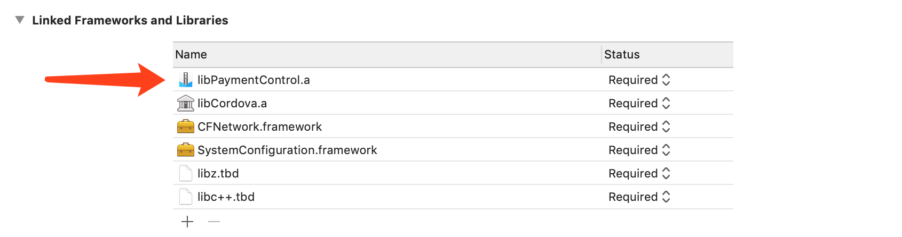

## 银联APP控件支付

## 安装
`cordova plugin add uppay-plugin`

## 注意
* android需要手动复制data.bin到assets目录中
* ios需要手动添加libPaymentControl.a,先移除libPaymentControl.a再添加
* ios appScheme 默认为'uppayplugin'


## 参考代码
```js
function pay() {
    window['UPPayPlugin'] && window['UPPayPlugin'].call(
        // 调用方法
        'pay',
        // 支付参数 tn
        ['43214324234123'],
        // 消息通知回调方法
        (res) => {
            alert(JSON.stringify(res));
            if (res.payResult === 'success') {
                alert('支付成功，验证参数' + res.resultData);
            } else {
                alert('支付失败');
                // fail:失败 cancel:取消
            }
        }
    );
}
```